**## Traffic Sign Recognition**

---

**Build a Traffic Sign Recognition Project**

The goals / steps of this project are the following:
* Load the data set (see below for links to the project data set)
* Explore, summarize and visualize the data set
* Design, train and test a model architecture
* Use the model to make predictions on new images
* Analyze the softmax probabilities of the new images
* Summarize the results with a written report

## Rubric Points
### Here I will consider the [rubric points](https://review.udacity.com/#!/rubrics/481/view) individually and describe how I addressed each point in my implementation.  

---
### Writeup / README

#### 1. Provide a Writeup / README that includes all the rubric points and how you addressed each one. You can submit your writeup as markdown or pdf. You can use this template as a guide for writing the report. The submission includes the project code.

You're reading it! and here is a link to my [project code](https://github.com/ahmadesh/Udacity-CarND-Traffic-Sign-Classifier/blob/master/Traffic_Sign_Classifier_customNet.ipynb)

### Data Set Summary & Exploration

#### 1. Provide a basic summary of the data set. In the code, the analysis should be done using python, numpy and/or pandas methods rather than hardcoding results manually.

I used the numpy library to calculate summary statistics of the traffic signs data set:

* The size of training set is : 34799
* The size of the validation set is : 4410
* The size of test set is : 12630
* The shape of a traffic sign image is : 32x32
* The number of unique classes/labels in the data set is : 43

The loading and analysis is located in the 1-2nd cell of the Ipython notebook.

#### 2. Include an exploratory visualization of the dataset.

Here is an exploratory visualization of the data set. It is a bar chart showing how random images from the training data set. The labels of these images are also pulled out from the provided CSV file.

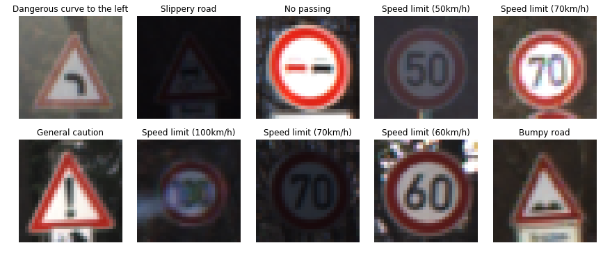

Next, I plot the histogram of the traing, validation and test sets. This shows how the image classes are distributed in each set.  

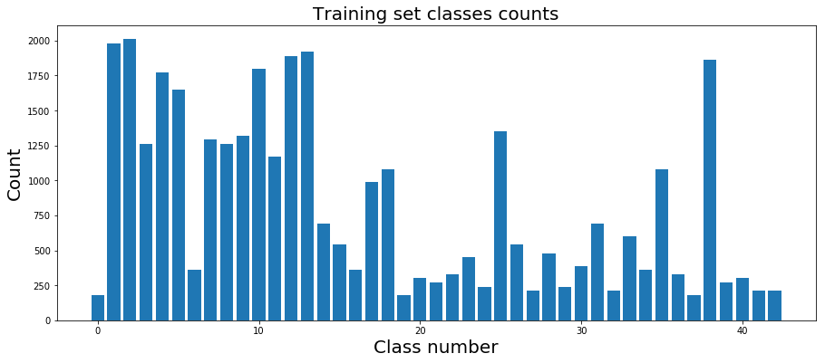
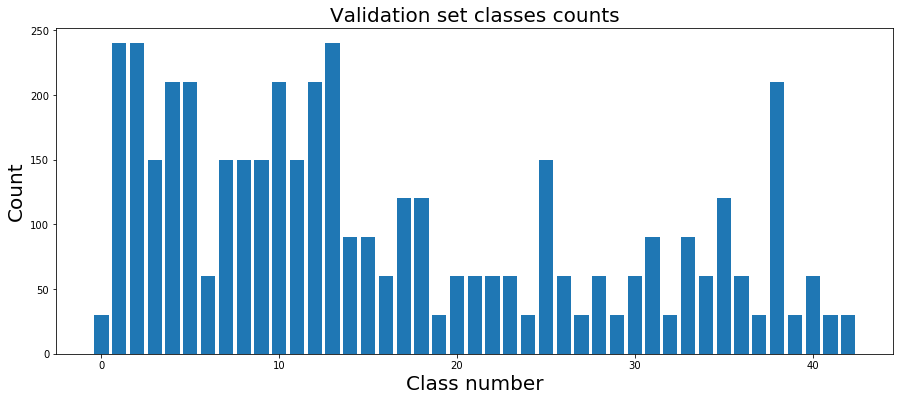
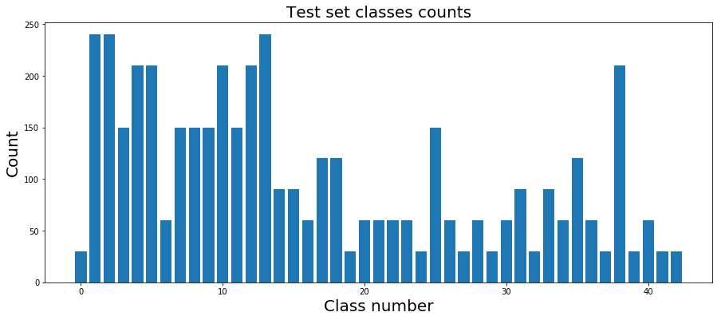

### Design and Test a Model Architecture

#### 1. Describe how you preprocessed the image data. What techniques were chosen and why did you choose these techniques? Consider including images showing the output of each preprocessing technique. Pre-processing refers to techniques such as converting to grayscale, normalization, etc. (OPTIONAL: As described in the "Stand Out Suggestions" part of the rubric, if you generated additional data for training, describe why you decided to generate additional data, how you generated the data, and provide example images of the additional data. Then describe the characteristics of the augmented training set like number of images in the set, number of images for each class, etc.)

As a first step, the image data are pre-processed. The following are the pre-processing steps:

* As stated in the paper by LeCun, the images are converted to YUV and the Y (luminance) componenet is only used. This method worked better, compared to gray-scale conversion. The other possibility is to input all channels to the network which was not necassory for the implemented model.

* The CV2 histogram equalizer function is used to equalize the histogram of the images. This method compensates for difference illumanation in the images.

* Finally the image data are normalized to have zero mean and equal variance [-1, 1].

Here is an example of a few random images before(left) and after(right) preprocessing .

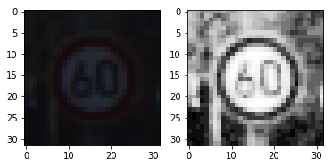
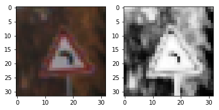
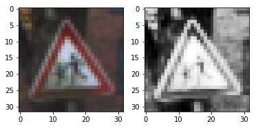
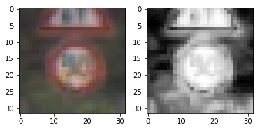
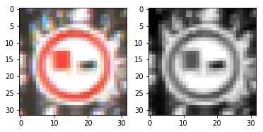

The code for preprocessing the images is located in the 5-6th cell of the Ipython notebook.

I decided to generate additional data because the distribution of the labels in the training set is not ballanced and causes biased predictions. The maximum number of examples in a class is 2010 and the minimum is 180. 

To add more data to the the data set, I used the following techniques: 

* Translating the image by a random number of pixels in [-3, 3] range.
* Rotating the image by a ranfom degree in [-10,10] range.
* Scaling the image by random transform pixels.
* Changing the brightness.

Here are a few exmaples with original image (left) and 3 augmented images:

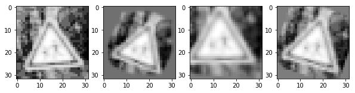
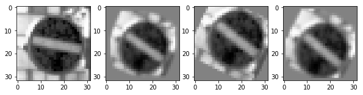
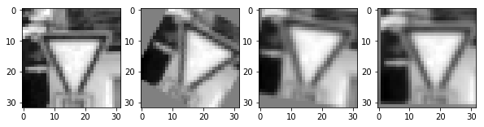
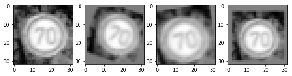
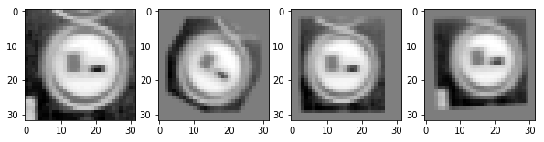

Next, new image examples in the training data set are created such that the minimum examples per class is 800. The final size of the training set is 46480. The new histogram of the training data set is: 

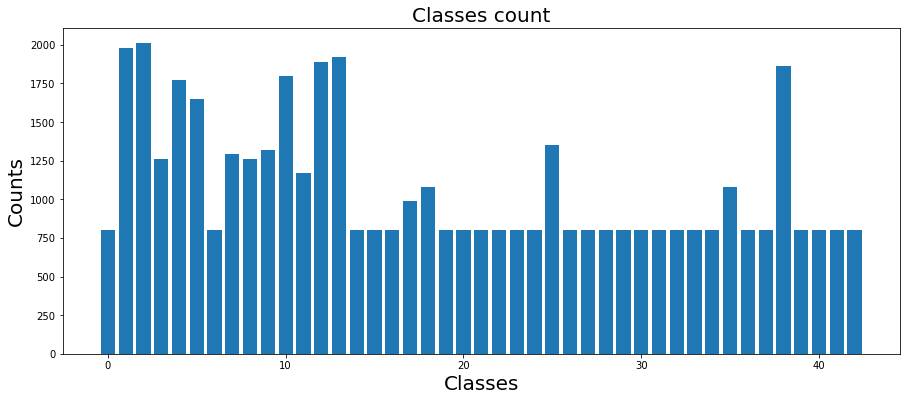

The code for augmenting the training data is located in the 9-11th cell of the Ipython notebook.

#### 2. Describe what your final model architecture looks like including model type, layers, layer sizes, connectivity, etc.) Consider including a diagram and/or table describing the final model.

My final model consisted of the following layers:

| Layer         		|     Description	        					| 
|:---------------------:|:---------------------------------------------:| 
| Input         		| 32x32x3 RGB image   							| 
| Convolution 3x3     	| 1x1 stride, Valid padding, outputs 30x30x8 	|
| RELU					|												|
| Convolution 3x3     	| 1x1 stride, Valid padding, outputs 28x28x16 	|
| RELU					|												|
| Max pooling	      	| 2x2 stride,  outputs 14x14x16 				|
| Convolution 3x3     	| 3x3 stride, Valid padding, outputs 12x12x32 	|
| RELU					|												|
| Convolution 3x3     	| 3x3 stride, Valid padding, outputs 10x10x32 	|
| RELU					|												|
| Max pooling	      	| 2x2 stride,  outputs 5x5x32 				    |
| Fully connected		| Input: 800, Output: Output = 120        		|
| Dropout				| 50% keep       								|
| Fully connected		| Input: 120, Output: Output = 84        		|
| Dropout				| 50% keep       								|
| Fully connected		| Input: 84, Output: Output = 43        		|
| Softmax				|         										|

The code for building the model is located in the 16-17th cell of the Ipython notebook.

#### 3. Describe how you trained your model. The discussion can include the type of optimizer, the batch size, number of epochs and any hyperparameters such as learning rate.

To train the model, I used an AdamOptimizer with traning rate of 0.0009. I used 30 epochs with batch size of 128. The other hyperparameter is the minimum number of training examples per class for data augmentation that, as mentioned before, I ended up with 800.

#### 4. Describe the approach taken for finding a solution and getting the validation set accuracy to be at least 0.93. Include in the discussion the results on the training, validation and test sets and where in the code these were calculated. Your approach may have been an iterative process, in which case, outline the steps you took to get to the final solution and why you chose those steps. Perhaps your solution involved an already well known implementation or architecture. In this case, discuss why you think the architecture is suitable for the current problem.

To get the best accuracy I tried differet:
* Preprocessing functions (graysclae, YUV conversion, etc.)
* Data augementation functions and minimum number of examples per class
* Hyperparameters such as training rate, epochs number, batch size. 
* Model architectures, LeNet, etc.

The validation accuracy as a function of the epoch number is shown:

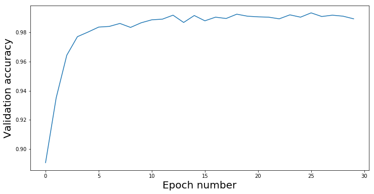

My final model results are:
* training set accuracy of 0.998
* validation set accuracy of 0.989
* test set accuracy of 0.968

The code for training and validation of the the model is located in the 18-21st cell of the Ipython notebook.

I also analyzed the false predictions on the test set. Here is the histogram of false predictions per class: 

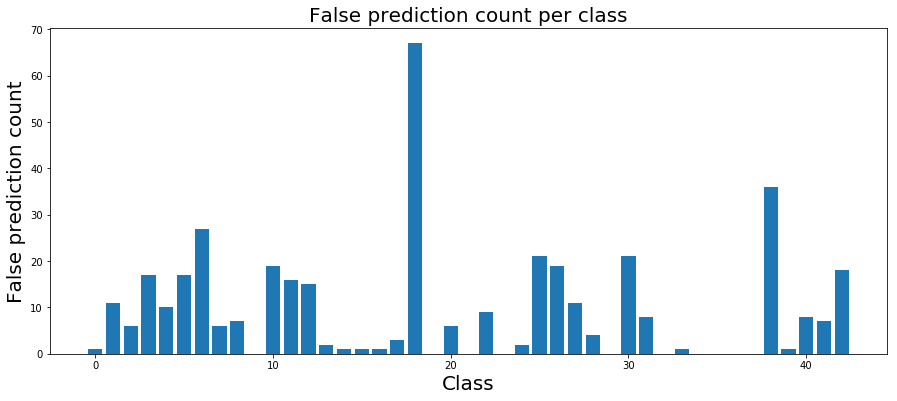

The 5 classes with the maximum number of false predictions are: 
* Beware of ice/snow 
* Road work
* End of speed limit (80km/h)
* Keep right
* General caution

Some of the random false predicted images of these classes are shown below. Some of these images are hard to predict for human as well, because of the bad quality of the images. However, some identifiable images are also misclassified and we can increase the number of training examples for these images to increase accuracy on these classes. 

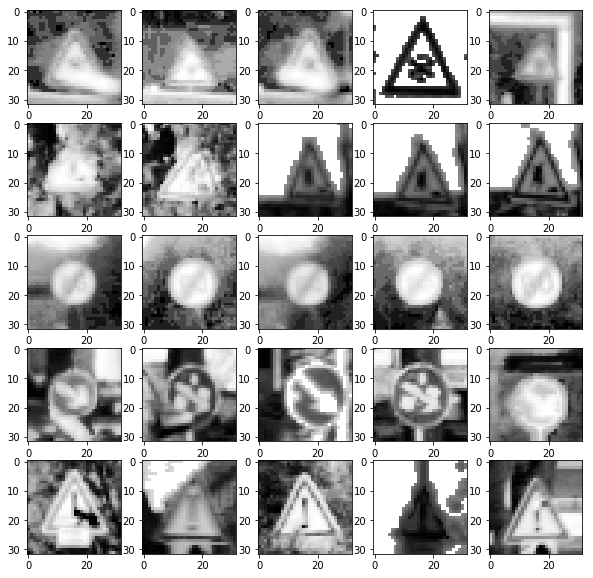

The code for analysis of the false predictions is located in the 22-24th cell of the Ipython notebook.

If an iterative approach was chosen:
1. What was the first architecture that was tried and why was it chosen?
 - I used the LeNet architecture as the initial network. It was the architecture that was provided as the example.
 
2. What were some problems with the initial architecture?
 - The validation accuracy was relatively low. The problem with the Convolution layers was their size (5x5) which is too big for the input images of 32x32. Also the network was not deep enough as the deeper netwerks could model more features.
 
3. How was the architecture adjusted and why was it adjusted? Typical adjustments could include choosing a different model architecture, adding or taking away layers (pooling, dropout, convolution, etc), using an activation function or changing the activation function. One common justification for adjusting an architecture would be due to overfitting or underfitting. A high accuracy on the training set but low accuracy on the validation set indicates over fitting; a low accuracy on both sets indicates under fitting.

- I first tried to decrease the Convolution sizes (3x3) and added more convolution layers to make the network deeper (I didn't change the ReLu layer after each Convolution). I also added the pooling layer in between every two Convolution layers. Finally after the convolution layers I added three fully connected layers for classification. I observed a high accuracy on the training set but low accuracy on the validation set that indicated over fitting. So I added drop-out units for regularization. 

4. Which parameters were tuned? How were they adjusted and why?

- Traning rate, epochs number, batch size, drop-out probability, minimum number of samples per class and the parameters for preprocessing and image augmentation were the parameters that I tuned. The training rate is adjusted as it determines how fast we minimize the loss function. I started with 0.001 and started to decreases it to find best inital acuracy and I chose 0.0009.  For the epochs number, after the initial high accuracy, I increased the epochs number to make sure the accuracy does not change much with more epochs number. The batch size I tried 128 and 256 which are the best values to be used in memory and setteled on 128. I changed drop-out probability to change regularization but finalized it at 50%. The minimum number of samples per class changed the accuracy a lot and I increased this number as much as I could (This data augmentation step could take huge CPU power). I also changed some of parameters for the opencv image processing functions for a higher accuracy. 

5. What are some of the important design choices and why were they chosen? For example, why might a convolution layer work well with this problem? How might a dropout layer help with creating a successful model?
- I think the important design choices are the using convolution vs fully connected network vs perception modules in the first layers. I chose convolution layers which makes the feature extraction independent of the position of the features. Perception modules could also be good candidates. The next questions are, how many layers do we need; do we need feedforward connection to have better gradient backpropagation (avoiding dead Relus); how do we need to preprocess the images; and how to create new examples for better distribution of examples per class. 

### Test a Model on New Images

#### 1. Choose five German traffic signs found on the web and provide them in the report. For each image, discuss what quality or qualities might be difficult to classify.

Here are five German traffic signs that I found on the web:

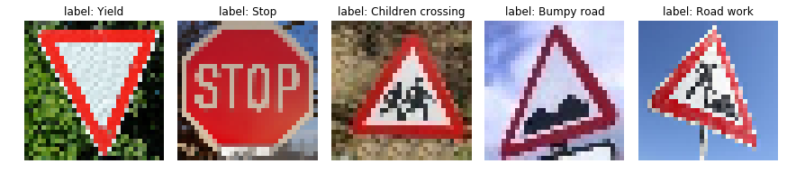

Labels of all new images were in the traing classes, however the lighting and angles of the new images could be different.

#### 2. Discuss the model's predictions on these new traffic signs and compare the results to predicting on the test set. At a minimum, discuss what the predictions were, the accuracy on these new predictions, and compare the accuracy to the accuracy on the test set (OPTIONAL: Discuss the results in more detail as described in the "Stand Out Suggestions" part of the rubric).

Here are the results of the prediction:

| Image			        |     Prediction	        					| 
|:---------------------:|:---------------------------------------------:| 
| Yield      			| Yield   										| 
| Stop     				| Stop 									 		|
| Children crossing		| Children crossing								|
| Bumpy road	      	| Bumpy Road					 				|
| Road work				| Bicycles crossing      						|

The model was able to correctly guess 4 of the 5 traffic signs, which gives an accuracy of 80%. This compares favorably to the accuracy on the test set of 96.85%.  

#### 3. Describe how certain the model is when predicting on each of the five new images by looking at the softmax probabilities for each prediction. Provide the top 5 softmax probabilities for each image along with the sign type of each probability. (OPTIONAL: as described in the "Stand Out Suggestions" part of the rubric, visualizations can also be provided such as bar charts)

The code for laoding and prediction on the new images is located in the 25-29th cell of the Ipython notebook. The probabilities of the model predictions are shown below:

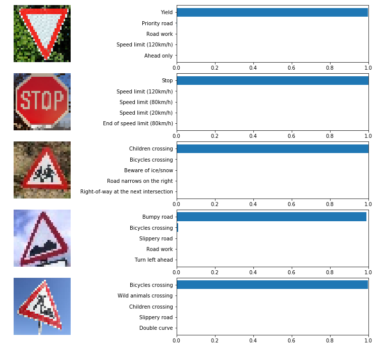

For the first three images, the model is relatively sure about the predictions. For the forth image the model is slightly unsure about the prediction. For the last image, which is a false prediction, surprisingly the model is sure about the prediction! Interestingly, the true class for the last image is "Road work" which is among the classes with the highest false predictions in the test set that was mentioned previously. This shows that the training set for this class are not proper enough and needs some more exploration for better prediction.

### (Optional) Visualizing the Neural Network (See Step 4 of the Ipython notebook for more details)
#### 1. Discuss the visual output of your trained network's feature maps. What characteristics did the neural network use to make classifications?

- The visulization of the layer 2 (after first two (3x3) convolutions), for the Yield input image is shown below for the 15 layers. The visualization shows the activated regions which are mostly on the boundries!

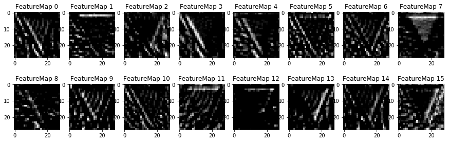

The code for visualizing the Neural Network is located in the 30-32nd cell of the Ipython notebook.